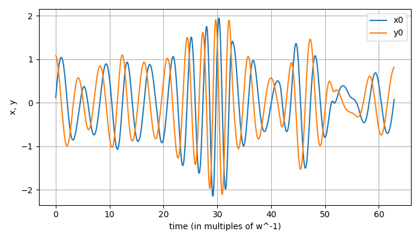
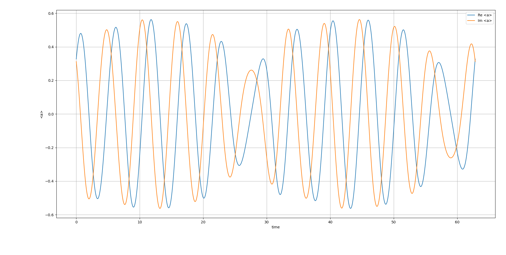

# multimode-tdvp

A variational Gaussian solver for multimode open quantum systems, based on the Time-Dependent Variational Principle (TDVP).

## Motivation

Exact simulation of open quantum systems requires evolving a density matrix whose size grows exponentially with the number of modes. For a single harmonic mode with Fock-space cutoff $N$, the state has $N$ amplitudes; for $d$ modes, $N^d$. This makes exact methods (QuTiP master equation, grid-based MCWF) intractable for even moderate $d$.

This solver instead represents the quantum state as a superposition of displaced, squeezed Gaussian (coherent) states:

$$|\psi\rangle = \sum_{p,\sigma} e^{\kappa_p + i\theta_p} |\sigma\rangle \otimes \bigotimes_k |\alpha_k^{(p)}, \beta_k^{(p)}\rangle$$

where $\sigma$ labels internal (spin) sectors, $\alpha_k$ is the coherent displacement, and $\beta_k$ is the squeezing parameter for mode $k$. The variational parameters $\{\kappa_p, \theta_p, \alpha_k^{(p)}, \beta_k^{(p)}\}$ are evolved via the McLachlan variational principle, reducing the exponential Hilbert space problem to one that scales as $O(N_\text{Gauss} \times d)$.

Open system dynamics (Lindblad dissipation) is handled via quantum trajectories (MCWF): between quantum jumps, the state evolves under a non-Hermitian effective Hamiltonian via TDVP; at a jump event, the jump operator is applied analytically within the Gaussian manifold.

## Structure

```
tdvp/
  solver.py       — core TDVP engine (TDVPSolver, rk4_step, jump helpers)
  gaussians.py    — analytic Gaussian expectation values <α,β|a^m (a†)^n|α',β'>

examples/
  kerr/           — anharmonic oscillator benchmark vs QuTiP
  cooling_1d/     — 1D sideband laser cooling (TDVP vs exact MCWF)
  cooling_2d/     — 2D sideband cooling, multimode (TDVP vs QuTiP) [in progress]
  lattice_heating/ — atom in a 1D optical lattice [planned]

results/
  kerr/           — benchmark plots comparing TDVP to QuTiP
```

## Key features

- **Multi-sector spin states** — Hamiltonian terms couple arbitrary spin sectors `(σ_bra, σ_ket)` with bosonic operators; the overlap matrix remains block-diagonal by orthogonality of spin sectors
- **Lamb-Dicke coupling** — laser-atom interaction terms include displacement $D(i\eta)$ applied analytically per jump
- **Analytic jump operators** — spin decay ($\sigma_-$), cavity loss ($a$), and recoil displacement ($D(\eta)$) are all handled analytically, keeping the state inside the Gaussian manifold
- **RK4 + adaptive stepping** — standard RK4 integrator with optional adaptive step size based on condition number of the overlap matrix
- **Pseudoinverse regularisation** — eigendecomposition-based pseudoinverse of the overlap matrix with tunable threshold, handling near-linear-dependence of Gaussians

## Method summary

The TDVP equations of motion follow from minimising $\| (i\partial_t - H_\text{eff})|\psi\rangle \|$ over the tangent space of the variational manifold (McLachlan principle). This gives:

$$G \dot{z} = F$$

where $G_{\mu\nu} = \text{Re}\langle \partial_\mu \psi | \partial_\nu \psi \rangle$ is the Gram (overlap) matrix, $F_\mu = -2\,\text{Im}\langle \partial_\mu \psi | H | \psi \rangle$ is the force vector for the Hermitian part, and the non-Hermitian (Lindblad) contribution enters as $-\text{Re}\langle \partial_\mu \psi | \sum_j L_j^\dagger L_j | \psi \rangle$.

All matrix elements reduce to products of single-mode Gaussian expectation values $\langle \alpha, \beta | a^m (a^\dagger)^n | \alpha', \beta' \rangle$, computed analytically in `gaussians.py`.

## Results

### Kerr oscillator benchmark

$H = \omega a^\dagger a + \mu (a^\dagger)^2 a^2$, initial coherent + squeezed state, $\mu = 0.1\omega$.

| TDVP (4 Gaussians) | QuTiP (exact) |
|---|---|
|  |  |

Phase-space and momentum distributions match to high accuracy with only 4 Gaussian components.

## Usage

```python
from tdvp.solver import GaussianComponent, HierarchicalState, TDVPSolver, pack_state, rk4_step

# define initial state
psi = HierarchicalState()
psi.add_gaussian("g", GaussianComponent(kappa=0.0, theta=0.0,
                                         x=[1.0], y=[0.0],
                                         r=[0.0], phi=[0.0]))

# define Hamiltonian: (coeff, sigma_bra, sigma_ket, ops_dict)
# ops_dict: {mode_k: (m, n)} for a^m (a†)^n on mode k
H_terms = [(omega, "g", "g", {0: (1, 1)})]   # omega * a†a
K_terms = []                                    # Lindblad: L†L terms

solver = TDVPSolver(psi, H_terms, K_terms)
z = pack_state(psi, solver.nus)

for _ in range(n_steps):
    z = rk4_step(z, dt, solver)
```

## Requirements

```
numpy
scipy
joblib
matplotlib
qutip   # for benchmarking only
```

## Planned

- 2D laser cooling: TDVP vs QuTiP benchmark demonstrating multimode capability
- 1D optical lattice: heating dynamics, comparison with exact grid-based MCWF ([soft-mcwf](https://github.com/krishnasogathur/soft-mcwf))
