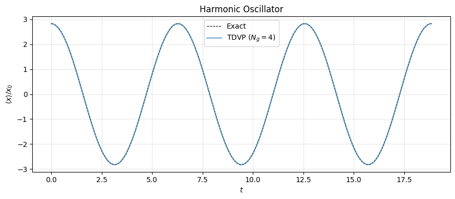
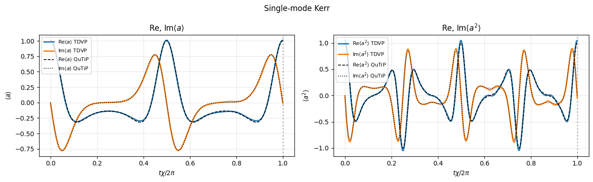
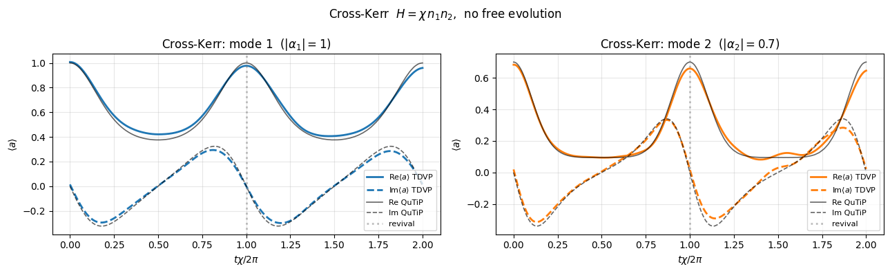
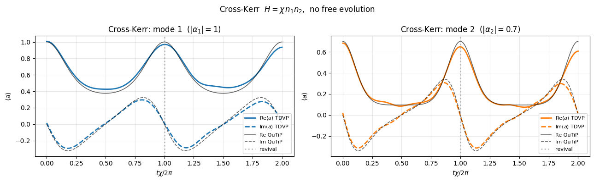
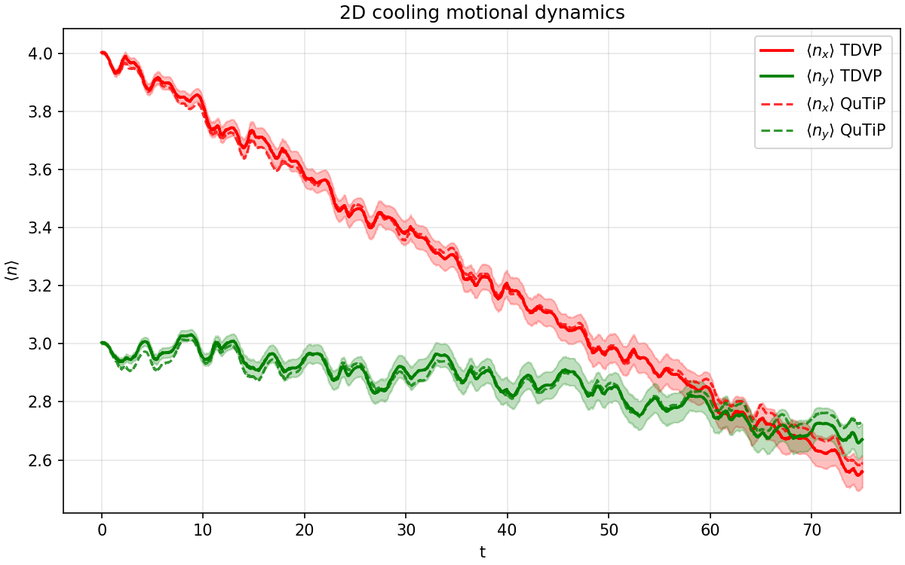
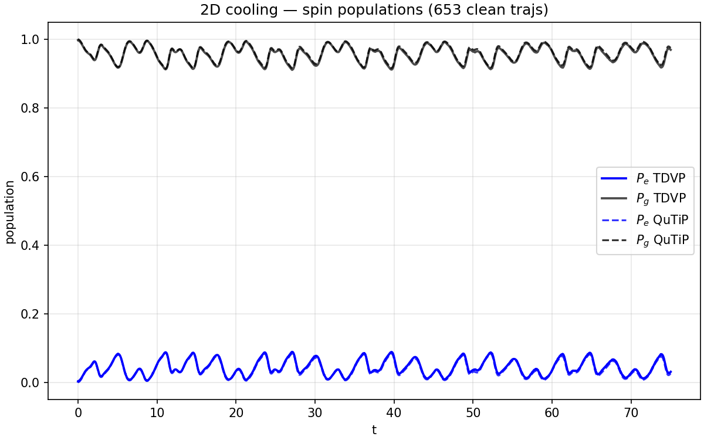

# multimode-tdvp

A sum-of-Gaussians (SoG) TDVP solver for multimode open quantum systems. The ansatz is a superposition of Gaussian states - non-Gaussian overall - evolved under the McLachlan variational principle.

## Motivation

Exact simulation of open quantum systems requires evolving a density matrix whose size grows exponentially with the number of modes. For a single harmonic mode with Fock-space cutoff $N$, the state has $N$ amplitudes; for $d$ modes, $N^d$. This makes exact methods (QuTiP master equation, grid-based MCWF) intractable for even moderate $d$.

This solver instead represents the quantum state as a superposition of displaced, squeezed Gaussian (coherent) states:

$$|\psi\rangle = \sum_{p,\sigma} e^{\kappa_p + i\theta_p} |\sigma\rangle \otimes \bigotimes_k |\alpha_k^{(p)}, \beta_k^{(p)}\rangle$$

where $\sigma$ labels internal (spin) sectors, $\alpha_k$ is the coherent displacement, and $\beta_k$ is the squeezing parameter for mode $k$. The variational parameters $\{\kappa_p, \theta_p, \alpha_k^{(p)}, \beta_k^{(p)}\}$ are evolved via the McLachlan variational principle, reducing the exponential Hilbert space problem to one that scales as $O(N_\text{Gauss} \times d)$.

Open system dynamics (Lindblad dissipation) is handled via quantum trajectories (MCWF): between quantum jumps, the state evolves under a non-Hermitian effective Hamiltonian via TDVP; at a jump event, the jump operator is applied analytically within the Gaussian manifold.

## Structure

```
tdvp/
  solver.py       - core TDVP engine (TDVPSolver, rk4_step, jump helpers)
  gaussians.py    - analytic Gaussian expectation values <α,β|a^m (a†)^n|α',β'>

examples/
  benchmarks/
    tdvp_benchmarks.ipynb   - HO, Kerr, cross-Kerr, non-Hermitian norm decay
  cooling_2d/
    2dcoolingtest.py        - 2D sideband cooling trajectories (TDVP)
    helper.py               - Gaussian expectation helpers (legacy)
    analysis/
      traj_diagnostics.py   - filter bad trajectories (norm blowup)
      cooling_2d_eval.py    - load trajectories, run QuTiP, produce comparison plots

results/
  benchmarks/     - HO, Kerr, cross-Kerr benchmark plots vs QuTiP/exact
  cooling_2d/     - 2D cooling: phonon number and population vs time
```

## Key features

- **Multi-sector spin states** - Hamiltonian terms couple arbitrary spin sectors `(σ_bra, σ_ket)` with bosonic operators; the overlap matrix remains block-diagonal by orthogonality of spin sectors
- **Lamb-Dicke coupling** - laser-atom interaction terms include displacement $D(i\eta)$ applied analytically per jump
- **Analytic jump operators** - spin decay ($\sigma_-$), cavity loss ($a$), and recoil displacement ($D(\eta)$) all handled analytically, keeping the state inside the Gaussian manifold
- **Dirac-Frenkel / McLachlan branching** - Dirac-Frenkel (symplectic solve) used for closed dynamics (energy-conserving); McLachlan (pseudoinverse) used when dissipation is present
- **RK4 + adaptive stepping** - standard RK4 integrator with optional adaptive step size based on condition number of the overlap matrix
- **Pseudoinverse regularisation** - eigendecomposition-based pseudoinverse of the overlap matrix with tunable threshold, handling near-linear-dependence of Gaussians

## Method summary

The TDVP equations of motion follow from minimising $\| (i\partial_t - H_\text{eff})|\psi\rangle \|$ over the tangent space of the variational manifold (McLachlan principle). This gives:

$$G \dot{z} = F$$

where $G_{\mu\nu} = \text{Re}\langle \partial_\mu \psi | \partial_\nu \psi \rangle$ is the Gram (overlap) matrix, $F_\mu = -2\,\text{Im}\langle \partial_\mu \psi | H | \psi \rangle$ is the force vector for the Hermitian part, and the non-Hermitian (Lindblad) contribution enters as $-\text{Re}\langle \partial_\mu \psi | \sum_j L_j^\dagger L_j | \psi \rangle$.

All matrix elements reduce to products of single-mode Gaussian expectation values $\langle \alpha, \beta | a^m (a^\dagger)^n | \alpha', \beta' \rangle$, computed analytically in `gaussians.py`.

## Results

### Benchmark suite

| Harmonic Oscillator | Single-mode Kerr |
|---|---|
|  |  |

| Cross-Kerr (mode 1) | Cross-Kerr (mode 2) |
|---|---|
|  |  |

### 2D sideband cooling

TDVP trajectories vs QuTiP (`mcsolve`, Fock cutoff 35) for a two-mode atom-light system with Lamb-Dicke coupling.

| Phonon number $\langle n \rangle$ vs time | Internal state populations vs time |
|---|---|
|  |  |

## Usage

```python
from tdvp.solver import GaussianComponent, HierarchicalState, Nu, TDVPSolver, pack_state, rk4_step

# define initial state
psi = HierarchicalState()
psi.add_gaussian("g", GaussianComponent(kappa=0.0, theta=0.0,
                                        x=[1.0], y=[0.0],
                                        r=[0.0], phi=[0.0]))

# define Hamiltonian: (coeff, sigma_bra, sigma_ket, ops_dict)
# ops_dict: {mode_k: (m, n)} for a^m (a†)^n on mode k
H_terms = [(omega, "g", "g", {0: (1, 1)})]   # omega * a†a
K_terms = []                                   # Lindblad: (1/2) L†L terms

nus = [Nu(s, p, k, kind)
       for s in ["g"] for p in range(N_gauss)
       for k in range(1) for kind in ["x", "y", "r", "phi"]
       if not (kind in ["kappa", "theta"] and k > 0)]
# prepend kappa/theta per Gaussian
nus = [Nu("g", p, 0, t) for p in range(N_gauss) for t in ["kappa", "theta"]] + nus

solver = TDVPSolver(psi, nus, H_terms, K_terms=K_terms)
z = pack_state(psi, nus)

for _ in range(n_steps):
    z = rk4_step(z, dt, solver)
```

See `examples/benchmarks/tdvp_benchmarks.ipynb` for complete worked examples (HO, Kerr, cross-Kerr, non-Hermitian decay).

## Requirements

```
numpy
scipy
joblib
matplotlib
numba
qutip   # for benchmarking only
```

## Planned

- Lattice heating benchmark vs exact grid-based MCWF ([soft-mcwf](https://github.com/krishnasogathur/soft-mcwf))

## References

- L. Hackl, T. Guaita, T. Shi, J. Haegeman, E. Demler, J. I. Cirac, "Geometry of variational methods: dynamics of closed quantum systems," [SciPost Phys. **9**, 048 (2020)](https://scipost.org/SciPostPhys.9.4.048)
- L. J. Bond, B. Gerritsen, J. Minář, J. T. Young, J. Schachenmayer, A. Safavi-Naini, "Open quantum dynamics with variational non-Gaussian states and the truncated Wigner approximation," [J. Chem. Phys. **161**, 184113 (2024)](https://doi.org/10.1063/5.0226268)
